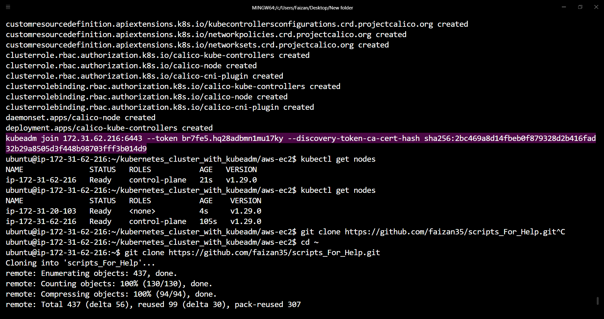
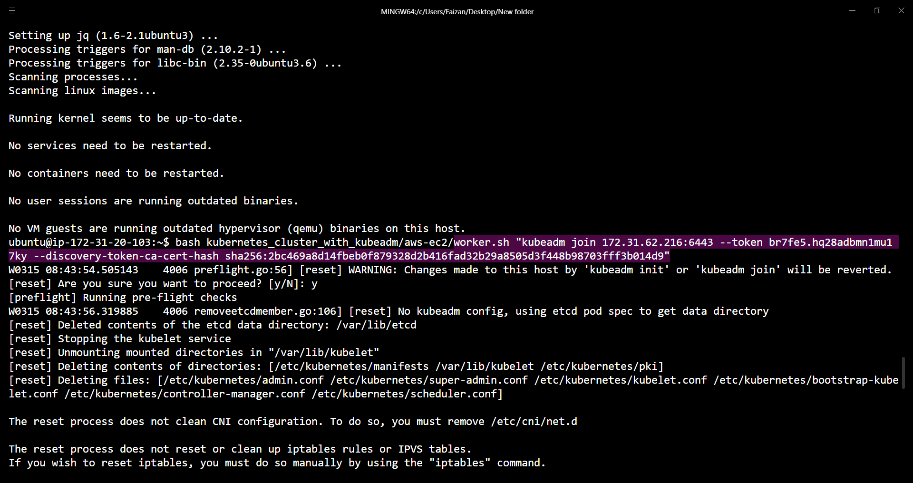

# kubernetes cluster with kubeadm

This repository provides instructions and scripts to create a Kubernetes cluster using kubeadm, with different methods.

## Method 1: Using Vagrant <--- In Progress --->

This method utilizes Vagrant to provision virtual machines locally and set up a Kubernetes cluster using kubeadm.

### Install

- [Vagrant](https://developer.hashicorp.com/vagrant/install)
- [VirtualBox (Recommended)](https://www.virtualbox.org/wiki/Downloads) or [VMware](https://www.vmware.com/products/workstation-pro.html)

### Usage

1. Clone this repository:

   ```bash
   git clone https://github.com/faizan35/kubernetes_cluster_with_kubeadm.git
   ```

2. Navigate to the Vagrant directory:

   ```bash
   cd kubernetes_cluster_with_kubeadm/vagrant
   ```

3. Customize the Vagrantfile if necessary.

4. Start the virtual machines:

   ```bash
   vagrant up
   ```

5. Once the machines are provisioned, SSH into the master node:

   ```bash
   vagrant ssh master
   ```

6. Follow the instructions to initialize the Kubernetes cluster using kubeadm.

## Method 2: On AWS with EC2 (without terraform)

This method involves deploying Kubernetes cluster nodes on AWS EC2 instances.

### Prerequisites

- AWS Account with appropriate permissions
- **Instance type:**
  - control-plane = **t2.medium** or larger.
  - node = same as control-plan or **t2.small** will also work.

### Usage

1. Clone this repository:

   ```bash
   git clone https://github.com/faizan35/kubernetes_cluster_with_kubeadm.git
   ```

2. Navigate to the AWS directory:

   ```bash
   cd kubernetes_cluster_with_kubeadm/aws-ec2
   ```

3. Execute `common.sh` on **ALL the instance**:

   ```bash
   bash ./common.sh
   ```

4. Execute `master.sh` on your control-plane ONLY:

   ```bash
   bash ./master.sh
   ```

   - You will get `kubeadm token`, **Copy it**.

      

5. Execute `worker.sh` on all you nodes:

   ```bash
   bash ./worker.sh "paste your token here"
   ```

   - Inside double quotes paste your token.

      

6. Your Kubernetes cluster is ready.

## Method 3: On AWS with EC2 (with terraform) <--- In Progress --->

This method involves deploying Kubernetes cluster nodes on AWS EC2 instances.

### Prerequisites

- AWS Account with appropriate permissions

### Usage

1. Clone this repository:

   ```bash
   git clone https://github.com/faizan35/kubernetes_cluster_with_kubeadm.git
   ```

2. Navigate to the AWS directory:

   ```bash
   cd kubernetes_cluster_with_kubeadm/tf-aws-ec2
   ```

3. Customize the Terraform configuration files if necessary.

4. Initialize Terraform:

   ```bash
   terraform init
   ```

5. Deploy the infrastructure:

   ```bash
   terraform apply
   ```

6. Once the instances are deployed, SSH into the master node:

   ```bash
   ssh -i <path_to_key_file> ubuntu@<master_public_ip>
   ```

7. Follow the instructions to initialize the Kubernetes cluster using kubeadm.

## Contributing

Contributions are welcome! If you have improvements or additional methods for creating Kubernetes clusters with kubeadm, feel free to submit a pull request.

## License

This project is licensed under the [MIT License](LICENSE).
