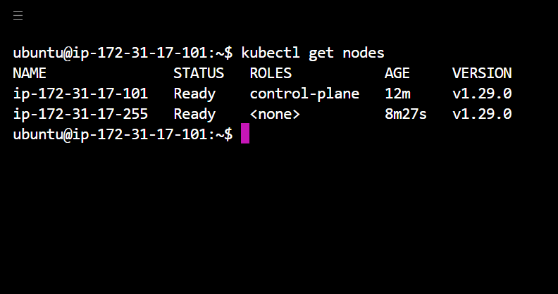

# If you like it, Hit the Star! ⭐

It took my time and effort, show some support by clicking the star icon on your top-right.

# kubernetes cluster with kubeadm

This repository provides instructions and scripts to create a Kubernetes cluster using kubeadm, with different methods.

## Common Step's

1. Execute `common.sh` on **ALL the instance**:

   ```bash
   bash ./common.sh
   ```

2. Execute `master.sh` on your control-plane ONLY:

   ```bash
   bash ./master.sh
   ```

   - You will get `kubeadm token`, **Copy it**.

      

3. Execute `worker.sh` on all you nodes (not in master or control-palne):

   ```bash
   bash ./worker.sh "paste your token here"
   ```

   - Inside double quotes paste your token.

      

4. Your Kubernetes cluster is ready.

   

---

## Method 1: Using Vagrant <--- In Progress --->

This method utilizes Vagrant to provision virtual machines locally and set up a Kubernetes cluster using kubeadm.

### Install

- [Vagrant](https://developer.hashicorp.com/vagrant/install)
- [VirtualBox (Recommended)](https://www.virtualbox.org/wiki/Downloads) or [VMware](https://www.vmware.com/products/workstation-pro.html)

### Usage

##### 1. Clone this repository:

```bash
git clone https://github.com/faizan35/kubernetes_cluster_with_kubeadm.git
```

##### 2. Navigate to the Vagrant directory:

```bash
cd kubernetes_cluster_with_kubeadm/vagrant
```

##### 3. Add your **bridge adapter** name in the `Vagrantfile`:

- `Vagrantfile`'s are inside **master** and **node** dir.
- keeping them seperate, saves time for booting both vm's.
- You will find `bridge: "Your-Bridge-Adapter-name"`, replace it with your bridge adapter name.
- Do this for both the `Vagrantfile`, Save them.
- If you dont know you bridge adapter name, [click here](./vagrant/Find-your-bridge.md).

##### 4. Run the script to Start both the vm's:

```bash
bash ./both-vm.sh
```

- You will get the IP address of your both vm's.

  ```bash
  This is your node IP = <node IP>
  This is your master IP = <master IP>
  Both VMs are up.
  ```

##### 5. SSH into the vm's:

1. You can use the `IP` to SSH into the master & node vm's, from any location.

   ```bash
   ssh vagrant@<node or master IP>
   ```

   - **Putty** will also work.

2. or, you can navigate to the respective vm's dir and use vagrant to SSH.

   ```bash
   vagrant ssh master
   ```

##### 6. Execute the scripts to Set-up Kubadm cluster:

- Inside your vm's, you will find `scripts/` dir.

1. Navigate to the scripts directory:

   ```bash
   cd scripts/
   ```

2. Now follow the [Common Steps's](#common-steps).

---

## Method 2: On AWS with EC2 (without terraform)

This method involves deploying Kubernetes cluster nodes on AWS EC2 instances.

### Prerequisites

- AWS Account with appropriate permissions
- **Instance type:**
  - control-plane = **t2.medium** or larger.
  - node = same as control-plane or **t2.small** will also work.

### AWS Setup

- Make sure your all instance are in same **Security group**.
- Expose port **6443** in the **Security group**, so that worker nodes can join the cluster.

### Usage

1. Clone this repository:

   ```bash
   git clone https://github.com/faizan35/kubernetes_cluster_with_kubeadm.git
   ```

2. Navigate to the AWS directory:

   ```bash
   cd kubernetes_cluster_with_kubeadm/aws-ec2
   ```

3. Now follow the [**Common Steps's**](#common-steps).

---

## Method 3: On AWS with EC2 (with terraform) <--- In Progress --->

This method involves deploying Kubernetes cluster nodes on AWS EC2 instances.

### Prerequisites

- AWS Account with appropriate permissions

### Usage

1. Clone this repository:

   ```bash
   git clone https://github.com/faizan35/kubernetes_cluster_with_kubeadm.git
   ```

2. Navigate to the AWS directory:

   ```bash
   cd kubernetes_cluster_with_kubeadm/tf-aws-ec2
   ```

3. Customize the Terraform configuration files if necessary.

4. Initialize Terraform:

   ```bash
   terraform init
   ```

5. Deploy the infrastructure:

   ```bash
   terraform apply
   ```

6. Once the instances are deployed, SSH into the master node:

   ```bash
   ssh -i <path_to_key_file> ubuntu@<master_public_ip>
   ```

7. Follow the instructions to initialize the Kubernetes cluster using kubeadm.

## Contributing

Contributions are welcome! If you have improvements or additional methods for creating Kubernetes clusters with kubeadm, feel free to submit a pull request.

## License

This project is licensed under the [MIT License](LICENSE).
