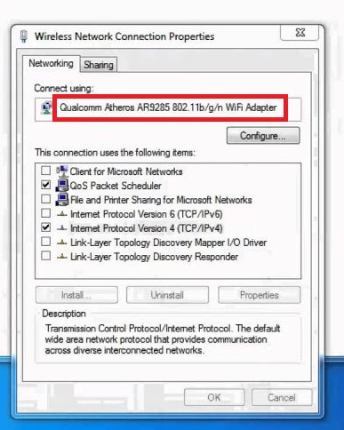

# Finding Bridge Adapter on Different Operating Systems

## Windows

1. Go to `Control Panel\Network and Internet\Network Connections`.
2. You will have Wi-Fi or Ethernet or more network adapters.
3. Choose the one which is responsible for internet connection in your PC.
4. Right click on it and click on Properties.
5. Name will be visible in front of you, copy it.



## Linux

1. Open a terminal window.
2. Type the following command and press Enter:
   ```bash
   ip link show
   ```
3. Look for an adapter with a description indicating it's a bridge adapter, often starting with "br" followed by a number.

## macOS

1. Click on the Apple menu in the top-left corner of the screen.
2. Select "System Preferences."
3. Click on "Network."
4. In the Network Preferences window, you'll see a list of network connections on the left side. Look for an adapter with a description indicating it's a bridge adapter, such as "Bridge" or similar.
